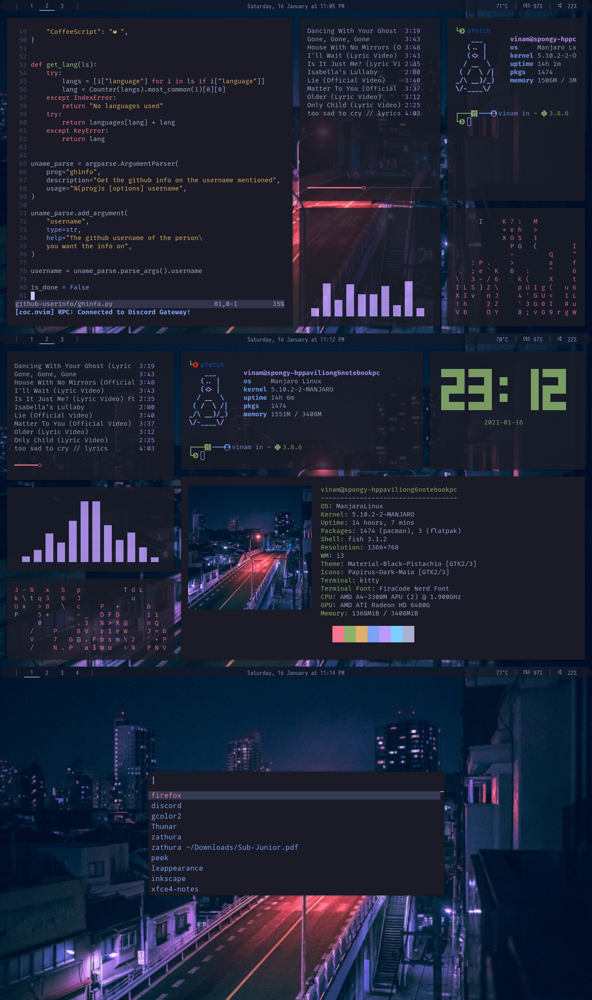
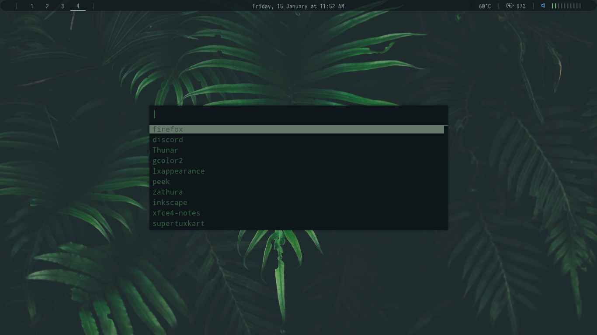

# Things I used

**Credit:**
material ocean theme's wallpaper credit to chillhop music.  
And credit to all the developers of all the other applications I used

## WM
- i3-gaps

#### Font
- 

## Terminal Utilities
- [kitty terminal](https://github.com/kovidgoyal/kitty) (the terminal itself)
- [starship](https://starship.rs) (for the prompt)
- [ncmpcpp](https://github.com/ncmpcpp/ncmpcpp) (the music player)
- [neovim](https://github.com/neovim/neovim) (code editor)
- [cava](https://github.com/karlstav/cava) (music visualizer)
- [neofetch](https://github.com/dylanaraps/neofetch) (fetch utility)
- [pfetch](https://github.com/dylanaraps/pfetch) (another fetch utility)
- [bunnfetch](https://github.com/elenapan/dotfiles/blob/master/bin/bunnyfetch) (one more fetch utility...)
- [tty-clock](https://github.com/xorg62/tty-clock) (the clock)
- [cmatrix](https://github.com/abishekvashok/cmatrix) (the floating glyphs)
- [pipes.sh](https://github.com/pipeseroni/pipes.sh) (the pipes)

#### Font
- 

## Bar
- [Polybar](https://github.com/polybar/polybar)

#### Font
- 

## Run Dialog
- [Rofi](https://github.com/davatorium/rofi)

## Compositor
- [Picom](https://github.com/yshui/picom) (the latest git version for the rounded corners)

# Screenshots

## material-ocean

## tokyo-night

## greenrice

